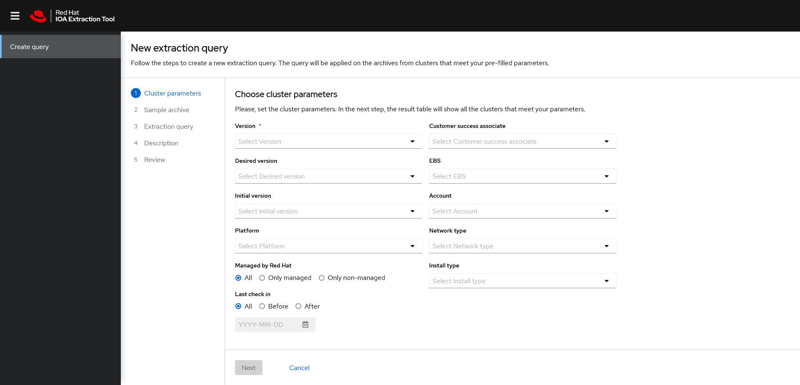

# IOA (Insights Operator Archive) Extraction Tool

IOA Extraction Tool aims to simplify the extraction workflow for Insights Operator archives. It provides a user interface to observe archives from the clusters that meet parameters defined by the user (cluster version, platform type, etc.), perform data extractions from the selected archives, and save the extraction results.

Out of the box, the repository provides only the front-end layer (UI of the whole application) that works with the mocked data. The application is under active development; further integration details will be added to this README file.



## Mock-up

The prototype (mock-up) of the tool can be found here: 

https://www.figma.com/proto/wXBxM0W4CDl6GlUsFoKPeK/High-fidelity-Guru?node-id=1%3A9752&starting-point-node-id=1%3A9752)
## Quick-start

```bash
# You have to be a member of the repository in order to clone it
git clone https://github.com/gkarat/ioa-extraction-tool.git
cd ioa-extraction-tool
npm install && npm run start:dev
```
## Development scripts
```sh
# Install development/build dependencies
npm install

# Start the development server
npm run start:dev

# Run a production build (outputs to "dist" dir)
npm run build

# Run the test suite
npm run test

# Run the test suite with coverage
npm run test:coverage

# Run the linter
npm run lint

# Run the code formatter
npm run format

# Launch a tool to inspect the bundle size
npm run bundle-profile:analyze

# Start the express server (run a production build first)
npm run start

## Configurations
* [TypeScript Config](./tsconfig.json)
* [Webpack Config](./webpack.common.js)
* [Jest Config](./jest.config.js)
* [Editor Config](./.editorconfig)

## Raster image support

To use an image asset that's shipped with PatternFly core, you'll prefix the paths with "@assets". `@assets` is an alias for the PatternFly assets directory in node_modules.

For example:
```js
import imgSrc from '@assets/images/g_sizing.png';

```

You can use a similar technique to import assets from your local app, just prefix the paths with "@app". `@app` is an alias for the main src/app directory.

```js
import loader from '@app/assets/images/loader.gif';

```

